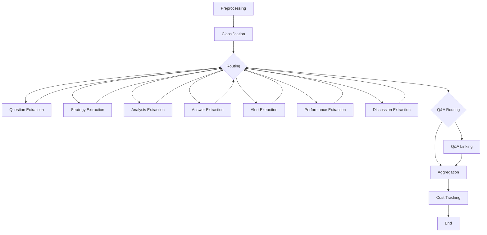

# LangGraph-based Discord Knowledge Graph Extraction

A redesigned architecture for extracting structured knowledge triples from Discord conversations using LangGraph for better workflow orchestration, maintainability, and extensibility.

## 🎯 Overview

This system transforms Discord messages into structured knowledge graph triples using a modular, node-based workflow. It processes different message types (questions, strategies, analysis, answers, etc.) through specialized extraction pipelines with proper error handling and cost tracking.

### Key Improvements

- **🏗️ Modular Architecture**: Each processing step is a separate, testable node
- **🔄 Workflow Orchestration**: LangGraph manages complex conditional routing
- **🛡️ Error Handling**: Comprehensive retry logic and error recovery
- **💰 Cost Tracking**: Detailed analytics for LLM API usage
- **⚙️ Configuration**: Centralized YAML-based prompt and parameter management
- **🔌 Extensible**: Easy to add new message types or extraction methods

## 📁 Architecture

```
src/discord_kg/extraction/llm_powered/
├── workflow_state.py      # Type-safe state definitions
├── config.py             # Configuration management
├── llm_providers.py      # LLM provider abstractions
├── nodes.py              # Individual workflow nodes
├── workflow.py           # Main LangGraph orchestration
├── extractor_langgraph.py # CLI interface
├── prompts.yaml          # Prompt templates and configuration
└── requirements.txt      # Dependencies
```

### Workflow Flow



## 🚀 Quick Start

### Installation

```bash
pip install -r requirements.txt
```

### Environment Setup

```bash
# For OpenAI
export OPENAI_API_KEY="your_openai_key"
export OPENAI_MODEL="gpt-3.5-turbo"  # optional

# For Claude
export ANTHROPIC_API_KEY="your_anthropic_key" 
export ANTHROPIC_MODEL="claude-3-haiku-20240307"  # optional
```

### Basic Usage

```bash
# Using OpenAI
python extractor_langgraph.py messages.jsonl triples.jsonl --provider openai

# Using Claude with custom batch size
python extractor_langgraph.py messages.jsonl triples.jsonl --provider claude --batch-size 10

# With custom configuration
python extractor_langgraph.py messages.jsonl triples.jsonl --config custom_prompts.yaml
```

### Python API

```python
from discord_kg.extraction.llm_powered import ExtractionWorkflow

# Initialize workflow
workflow = ExtractionWorkflow(
    llm_provider="openai",
    batch_size=20,
    config_path="prompts.yaml"
)

# Process messages
messages = [
    {
        "message_id": "123",
        "author": "user1", 
        "clean_text": "What's the best strategy for covered calls?",
        "timestamp": "2024-01-01T00:00:00Z",
        "segment_id": "segment1"
    }
]

result = workflow.run(messages)
print(f"Extracted {len(result['triples'])} triples")
```

## 🔧 Configuration

### Prompt Configuration (prompts.yaml)

The system uses YAML configuration for prompt templates and settings:

```yaml
system:
  content: |
    You are an expert at extracting structured knowledge triples...

templates:
  question:
    description: "Extract question triples"
    instruction: |
      Extract question triples from these messages...
      Messages: {message_text}

config:
  confidence_scores:
    question: 0.85
    strategy: 0.88
    analysis: 0.82
    
  predicates:
    question: ["asks_about"]
    strategy: ["recommends", "discusses_strategy"]
```

### Workflow Configuration

```python
from discord_kg.extraction.llm_powered import ExtractionWorkflow

workflow = ExtractionWorkflow(
    llm_provider="openai",           # "openai" or "claude"
    llm_model="gpt-4",              # Override default model
    batch_size=20,                  # Messages per API call
    config_path="custom.yaml",      # Custom prompt config
    enable_checkpoints=True         # Enable workflow resumption
)
```

## 🏗️ Node Architecture

### Core Nodes

1. **Preprocessing Node**
   - Validates and cleans messages
   - Groups messages by segments
   - Handles missing fields

2. **Classification Node** 
   - Classifies messages by type (rule-based)
   - Types: question, strategy, analysis, answer, alert, performance, discussion

3. **Extraction Nodes** (per message type)
   - Type-specific LLM prompts
   - Batch processing for efficiency
   - Confidence scoring

4. **Q&A Linking Node**
   - Links questions to answers using LLM reasoning
   - Creates "answered_by" relationships

5. **Aggregation Node**
   - Deduplicates results
   - Validates triple structure
   - Quality filtering

6. **Cost Tracking Node**
   - Aggregates metrics across all nodes
   - Calculates efficiency metrics
   - Generates detailed reports

### Adding Custom Nodes

```python
from discord_kg.extraction.llm_powered.nodes import extraction_node_factory

# Create custom extraction node
extract_custom_node = extraction_node_factory("custom_type")

# Add to workflow (requires modifying workflow.py)
```

## 📊 Output Format

### Triple Structure

```json
{
  "subject": "user123",
  "predicate": "asks_about", 
  "object": "covered call strategies",
  "message_id": "msg_456",
  "segment_id": "segment_1",
  "timestamp": "2024-01-01T00:00:00Z",
  "confidence": 0.85,
  "extraction_method": "llm"
}
```

### Processing Summary

```json
{
  "status": "success",
  "triples": [...],
  "processing_summary": {
    "total_messages": 100,
    "total_triples": 150,
    "processing_time_seconds": 45.2,
    "message_classification": {
      "question": 25,
      "strategy": 30,
      "analysis": 20,
      "answer": 15,
      "discussion": 10
    },
    "extraction_results": {
      "question": {"status": "completed", "triples_extracted": 25}
    },
    "qa_linking": {"status": "completed", "links_created": 12}
  },
  "cost_summary": {
    "total_cost_usd": 2.45,
    "total_api_calls": 15,
    "cost_per_triple": 0.016,
    "provider": "openai"
  }
}
```

## 🛠️ Advanced Features

### Workflow Checkpointing

Enable checkpointing to resume failed workflows:

```python
workflow = ExtractionWorkflow(enable_checkpoints=True)
result = workflow.run(messages, thread_id="extraction_001")

# Resume from checkpoint
result = workflow.run(messages, thread_id="extraction_001")
```

### Real-time Monitoring

```python
# Stream workflow progress
for step in workflow.run_async(messages):
    print(f"Current step: {step['current_step']}")
    if 'cost_summary' in step:
        print(f"Current cost: ${step['cost_summary']['total_cost_usd']}")
```

### Custom LLM Providers

```python
from discord_kg.extraction.llm_powered.llm_providers import BaseLLMProvider

class CustomProvider(BaseLLMProvider):
    def _initialize_client(self):
        # Initialize your custom LLM client
        pass
    
    def _make_api_call(self, system_prompt, user_prompt):
        # Implement API call logic
        return {"content": "...", "usage": {...}}
```

## 🧪 Testing and Validation

### Validation Mode

```bash
# Validate configuration and input without processing
python extractor_langgraph.py messages.jsonl output.jsonl --validate-only

# Dry run (validate everything without API calls)
python extractor_langgraph.py messages.jsonl output.jsonl --dry-run
```

### Input Validation

The system validates:
- Required message fields (message_id, author, timestamp)
- JSON format correctness
- Message content availability
- Configuration file validity

## 📈 Performance and Cost Optimization

### Batch Size Tuning

- **Small batches (5-10)**: Higher accuracy, more expensive
- **Medium batches (15-25)**: Balanced accuracy/cost (recommended)
- **Large batches (50+)**: Lower cost, potentially reduced accuracy

### Model Selection

**OpenAI Options:**
- `gpt-3.5-turbo`: Cost-effective for most use cases
- `gpt-4`: Higher accuracy for complex analysis

**Claude Options:**
- `claude-3-haiku`: Fastest and cheapest
- `claude-3-sonnet`: Balanced performance
- `claude-3-opus`: Highest quality

### Cost Monitoring

```bash
# Monitor costs during processing
python extractor_langgraph.py messages.jsonl output.jsonl --log-level INFO

# Cost breakdown in output files:
# - output_cost_summary.json: Detailed cost analytics
# - output_processing_summary.json: Processing metrics
```

## 🔍 Troubleshooting

### Common Issues

1. **API Key Errors**
   ```bash
   export OPENAI_API_KEY="your_key_here"
   # or
   export ANTHROPIC_API_KEY="your_key_here"
   ```

2. **Memory Issues with Large Files**
   ```bash
   # Reduce batch size
   python extractor_langgraph.py input.jsonl output.jsonl --batch-size 5
   ```

3. **Rate Limiting**
   - The system includes automatic rate limiting
   - Increase delays in workflow configuration if needed

4. **Configuration Errors**
   ```bash
   # Validate configuration
   python extractor_langgraph.py input.jsonl output.jsonl --validate-only
   ```

### Debug Mode

```bash
python extractor_langgraph.py input.jsonl output.jsonl --log-level DEBUG --log-file debug.log
```

## 🤝 Contributing

### Adding New Message Types

1. Add type to `MessageType` enum in `workflow_state.py`
2. Add classification patterns in `classification_node()`
3. Create prompt template in `prompts.yaml`
4. Add extraction node using `extraction_node_factory()`
5. Update routing logic in `workflow.py`

### Custom Extraction Methods

Extend the system with rule-based or hybrid extraction:

```python
def custom_extraction_node(state: WorkflowState) -> WorkflowState:
    # Implement custom extraction logic
    # Update state with results
    return state
```

## 📝 License

MIT License - see LICENSE file for details.

## 🏷️ Version History

- **2.0.0**: Complete redesign with LangGraph architecture
- **1.x.x**: Original monolithic implementation (see `extractor_llm.py`)

---

For more examples and advanced usage, see the test files and example configurations in the repository.