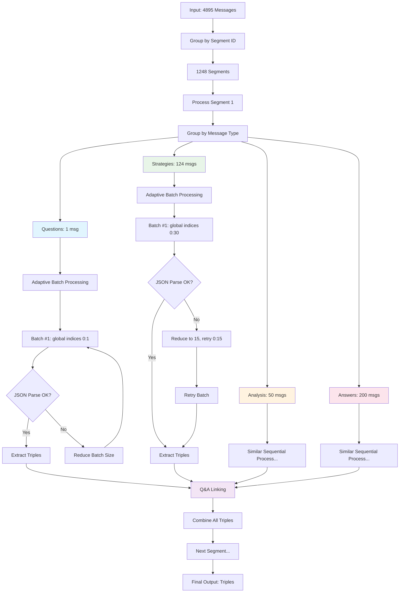
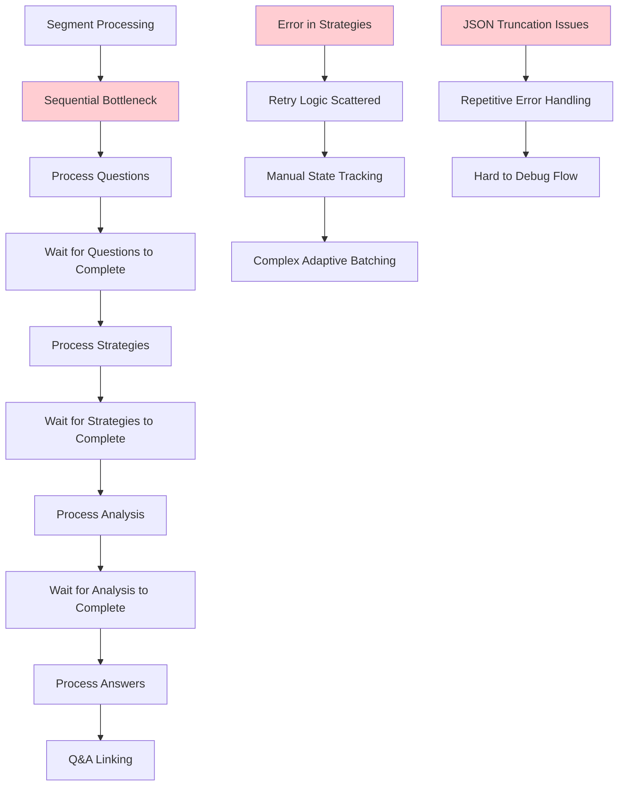
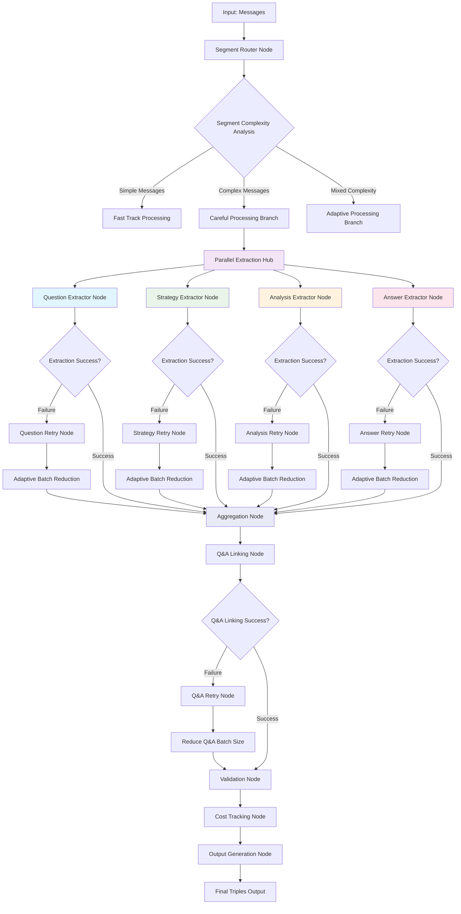
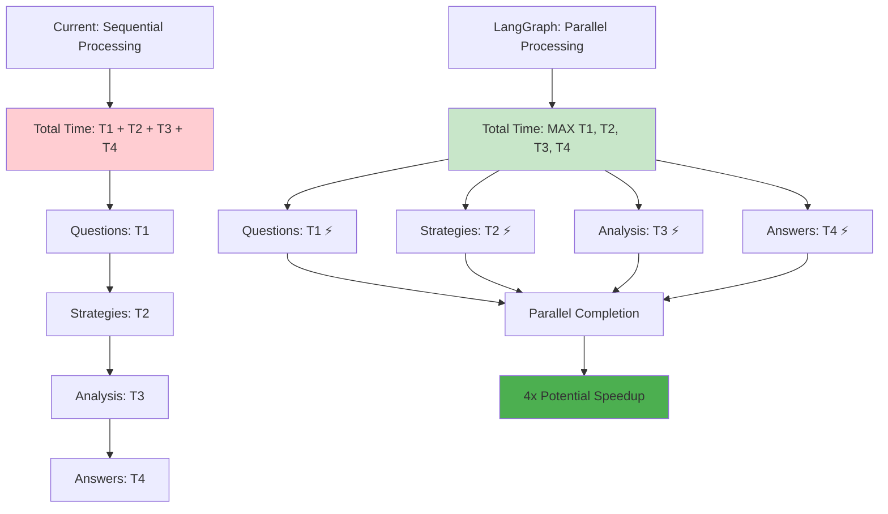
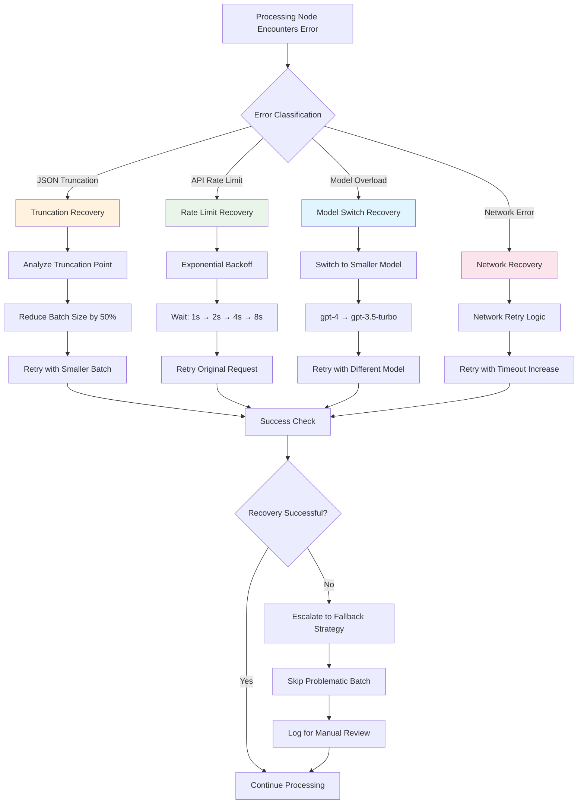
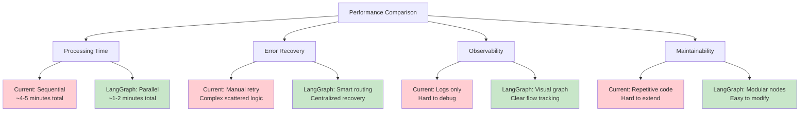
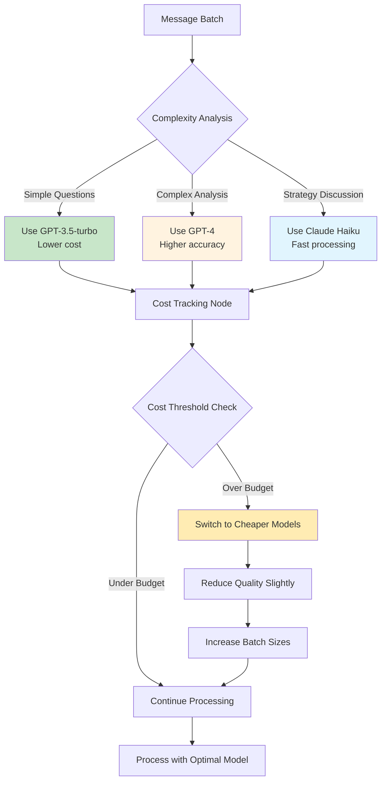
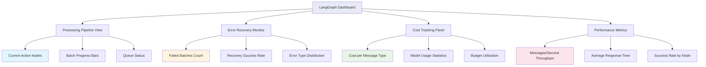

# Discord Knowledge Graph - LLM Extraction Flow Diagrams

## Current System Flow



## Current Issues Visualized



## LangGraph Enhanced System



## Parallel Processing Advantage



## Smart Error Recovery Flow



## State Management Comparison

```mermaid
graph TD
    subgraph "Current Manual State Tracking"
        A1[LLMSegmentProcessor] --> A2[_global_type_offsets: Dict]
        A2 --> A3[Manual offset tracking]
        A3 --> A4[Error-prone state updates]
        A4 --> A5[Scattered state across methods]
    end
    
    subgraph "LangGraph Centralized State"
        B1[ExtractionState] --> B2[messages: List[Dict]]
        B1 --> B3[batch_sizes: Dict[str, int]]
        B1 --> B4[processed_counts: Dict[str, int]]
        B1 --> B5[error_counts: Dict[str, int]]
        B1 --> B6[cost_tracking: Dict[str, float]]
        B1 --> B7[extracted_triples: List[Triple]]
        B1 --> B8[retry_states: Dict[str, Any]]
    end
    
    C[Processing Nodes] --> B1
    D[Question Node] --> B1
    E[Strategy Node] --> B1
    F[Analysis Node] --> B1
    G[Answer Node] --> B1
    H[Q&A Linking Node] --> B1
    
    style A4 fill:#ffcdd2
    style B1 fill:#c8e6c9
```

## Implementation Migration Path

```mermaid
graph LR
    subgraph "Phase 1: Wrapper Approach"
        A1[Keep Existing Logic] --> A2[Wrap in LangGraph Nodes]
        A2 --> A3[Add Parallel Execution]
        A3 --> A4[Immediate 4x Speedup]
    end
    
    subgraph "Phase 2: Smart Routing"
        B1[Add Complexity Analysis] --> B2[Dynamic Model Selection]
        B2 --> B3[Cost-Aware Routing]
        B3 --> B4[Advanced Error Recovery]
    end
    
    subgraph "Phase 3: Full Rewrite"
        C1[LangGraph-Native Design] --> C2[State-First Architecture]
        C2 --> C3[Multi-Agent Coordination]
        C3 --> C4[Advanced Orchestration]
    end
    
    A4 --> B1
    B4 --> C1
    
    style A4 fill:#e8f5e8
    style B4 fill:#fff3e0
    style C4 fill:#e1f5fe
```



## Performance Metrics Visualization



## Cost Optimization Flow



## Real-time Monitoring Dashboard Concept

